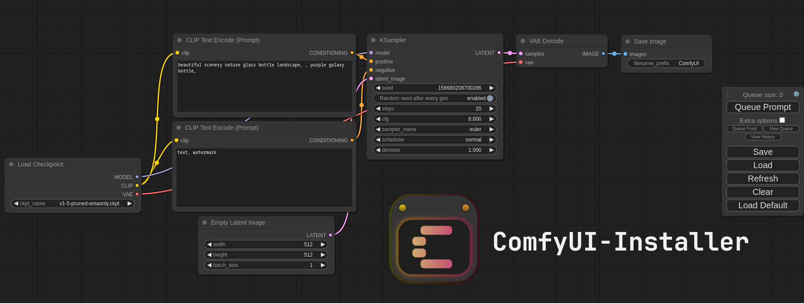

# ComfyUI Installer

Easily install ComfyUI (in a python venv) on Linux.
Tested on Arch + AMD GPU.


_Note:_ This is not the official ComfyUI icon.    

# Quick Start

Make sure to install for your GPU Vendor (AMD/Nvidia):

```
git clone https://github.com/HAMM3REXTREME/ComfyUI-Installer
cd ComfyUI-Installer
./install-amd.sh or ./install-nvidia.sh # Optionally add --menu-entry

./launch.sh # Launch
```

# Installation

1. To install ComfyUI using this script, **clone this repo and cd into it**:  
   `git clone https://github.com/HAMM3REXTREME/ComfyUI-Installer && cd ComfyUI-Installer`

2. After that is completed, install for either AMD or Nvidia.  
   **To install for AMD:** `./install-amd.sh`  
   **To install for Nvidia:** `./install-nvidia.sh`  
   _Tip:_ You can optionally add `--menu-entry` after your GPU vendor in order to make a desktop entry.

3. Almost done! You can now get your models and put them in their proper directories:  
   Put your SD checkpoints (the huge ckpt/safetensors files) in: `ComfyUI/models/checkpoints`  
   Put your VAE in: `ComfyUI/models/vae`

Once that is done, **launch ComfyUI using**: `./launch.sh`

# Updating

### Updating ComfyUI

Simply cd into the ComfyUI folder and run git pull:  
`cd ComfyUI && git pull`

### Upgrading python venv packages


**Make sure to check out the actual [ComfyUI repo](https://github.com/comfyanonymous/ComfyUI) for the most up to date information.**

1. Run `source venv/bin/activate` to activate the Python virtual environment.  
   (The installer creates a python venv named 'venv' in the base folder by default)

2. Upgrade torch, use the command for your GPU vendor (similar to the installer script):  
   **For AMD:** `pip install --upgrade torch torchvision torchaudio --index-url https://download.pytorch.org/whl/rocm6.0`  
   **For Nvidia:** `pip install --upgrade torch torchvision torchaudio --extra-index-url https://download.pytorch.org/whl/cu121`  
   _Some version numbers might be out of date here._

3. Upgrade ComfyUI dependencies by running this command (inside the ComfyUI folder):  
   `pip install --upgrade -r requirements.txt`

After this you should have everything updated and can proceed to running ComfyUI.

# Troubleshooting

If you get the "Torch not compiled with CUDA enabled" error, uninstall torch with:

`pip uninstall torch`

And install it again with the command above.

For AMD cards not officially supported by ROCm,
Try running it with this command if you have issues:

For 6700, 6600 and maybe other RDNA2 or older: `HSA_OVERRIDE_GFX_VERSION=10.3.0 python main.py`
This is the done by default in the launch script. Feel free to remove/edit it if you want.

For AMD 7600 and maybe other RDNA3 cards: `HSA_OVERRIDE_GFX_VERSION=11.0.0 python main.py`
