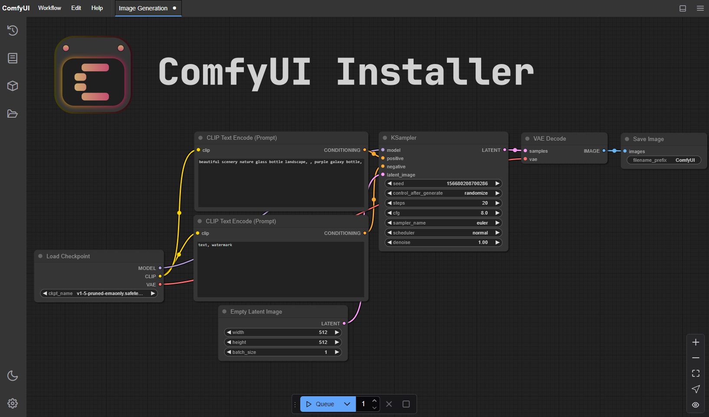

# ComfyUI Installer

Easily install ComfyUI + ComfyUI-Manager + ComfyUIMini (in a python venv) on Linux.
Tested on Arch + AMD GPU.
Tested on Ubuntu + Nvidia GPU.


_Note:_ This is not the official ComfyUI icon.

## Quick Start - Simple install (ALL DISTROS)

1. To install ComfyUI using the simple script (which won't have features like service files etc. but works on any distro), **clone the `simple` branch and cd into the repo**:  
   `git clone -b simple https://github.com/HAMM3REXTREME/ComfyUI-Installer && cd ComfyUI-Installer`

2. After that's done, run the install script for your GPU vendor (AMD or Nvidia). This might take a while.  
   **To install for AMD:** `./install-amd.sh`  
   **To install for Nvidia:** `./install-nvidia.sh`  
   _Tip:_ You can optionally run `./menu-entry.sh` in order to make a desktop menu entry.

3. When the install script has finished, you just need to copy/paste your models into their proper directories:  
   Put your SD checkpoints (the huge ckpt/safetensors files) in: `ComfyUI/models/checkpoints`  
   Put your VAE in: `ComfyUI/models/vae`

Once you've done that, **launch ComfyUI using**: `./launch.sh`

## Quick Start - UBUNTU SPECIFIC FEATURES

You will need to have `python`, `python-venv` and `pip` on your system.
Make sure to install for your GPU Vendor (AMD/Nvidia):

```sh
git clone https://github.com/itsdarklikehell/ComfyUI-Installer
cd ComfyUI-Installer
./install.sh # Installs ComfyUI, ComfyUI Manager and ComfyUIMini in a python venv
```
## Installation

1. To install ComfyUI using this script, **clone this repo and cd into it**:
   `git clone https://github.com/itsdarklikehell/ComfyUI-Installer && cd ComfyUI-Installer`

2. Then run the install script:
   `./install.sh`

3. When the install script has finished, ComfyUI systemd service should now be running, you can check the status of the service with:
   `sudo systemctl status ComfyUI.service`
   If it's not running, you can start it with:
   `sudo systemctl start ComfyUI.service`
   If you want to enable it to start on boot, you can do so with:
   `sudo systemctl enable ComfyUI.service`

4. Now you can download custom_nodes and models with the ComfyUI-Manager or copy/paste/clone custom_nodes and models into their proper directories:
   Put your SD checkpoints (the huge ckpt/safetensors files) in: `ComfyUI/models/checkpoints`
   Put your VAE in: `ComfyUI/models/vae` etc.

Once you've done that, ComfyUI and ComfyUIMini should be running on your system (give it a few seconds to start up).
Then open your browser and go to:
[http://0.0.0.0:8188/](http://0.0.0.0:8188/) for ComfyUI's interface (Works better on desktop devices).
[http://0.0.0.0:3000/](http://0.0.0.0:3000/) for ComfyUIMini's interface (Works better on mobile devices).
To check ComfyUI's status, run: `tail -f ComfyUI/logs/comfyui.log` or `journalctl -f -u ComfyUI.service`
To check ComfyUIMini's status, run: `tail -f ComfyUI/custom_nodes/ComfyUIMini/logs/comfyuimini.log` or `journalctl -f -u ComfyUIMini.service`

## Usage

**To Manually launch ComfyUI use**:

 `bash ./scripts/run_gpu.sh`
or
 `bash ./scripts/run_cpu.sh`.


**To Manually launch ComfyUIMini use**:

 `bash ./ComfyUI/custom_nodes/ComfyUIMini/scripts/start.sh`.

**To start ComfyUI systemd service use**:

 `sudo systemctl start ComfyUI.service`

**To start ComfyUIMini systemd service use**:

 `sudo systemctl start ComfyUIMini.service`

**To enable ComfyUI systemd service use**:

 `sudo systemctl enable ComfyUI.service`

**To enable ComfyUIMini systemd service use**:

 `sudo systemctl enable ComfyUIMini.service`

**To stop ComfyUI systemd service use**:

 `sudo systemctl stop ComfyUI.service`

**To stop ComfyUIMini systemd service use**:

 `sudo ystemctl stop ComfyUIMini.service`

**To restart ComfyUI systemd service use**:

 `sudo systemctl restart ComfyUI.service`

**To restart ComfyUIMini systemd service use**:

 `sudo systemctl restart ComfyUIMini.service`

**To check ComfyUI systemd service status use**:

 `sudo systemctl status ComfyUI.service`

**To check ComfyUIMini systemd service status use**:

 `sudo systemctl status ComfyUIMini.service`

## Updating

### Updating ComfyUI
Simply re-run the install.sh script should detect that ComfyUI is allready installed, it will then proceed to try and update it. Or if it is already running you could use the ComfyUI-Manager to update everything.

## Troubleshooting

### If you get the "Torch not compiled with CUDA enabled" error

Uninstall torch with:

`pip uninstall torch`

And install it again with the command (for Nvidia) above.

### For AMD cards not officially supported by ROCm

Try running it with this command if you have issues:

For 6700, 6600 and maybe other RDNA2 or older: `HSA_OVERRIDE_GFX_VERSION=10.3.0 python main.py`

For AMD 7600 and maybe other RDNA3 cards: `HSA_OVERRIDE_GFX_VERSION=11.0.0 python main.py`

You can add these changes (and other args you want) to `scripts/run_gpu.sh` for convenience.
