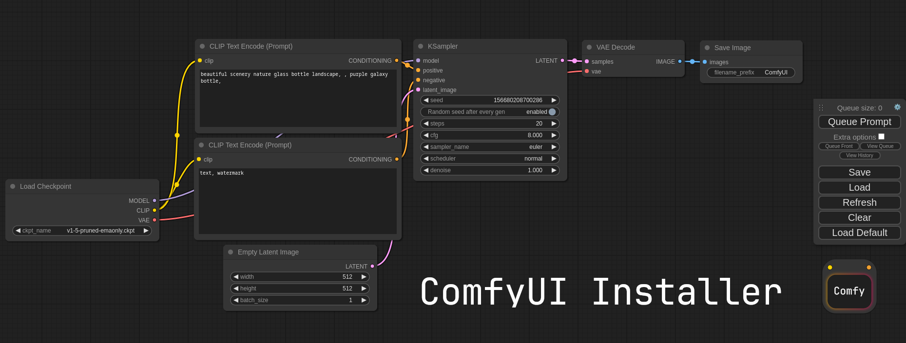

# ComfyUI Installer
Easily install ComfyUI portably on Linux.
Tested on Arch + AMD GPU.



## Usage
Launch the script with either `--amd` or `--nvidia` to install for either GPU vendor.


# Info
Put your SD checkpoints (the huge ckpt/safetensors files) in: `models/checkpoints`
Put your VAE in: `models/vae`

To access the python venv, use `source sdg/bin/activate` while in the ComfyUI directory.
Use this before running any python commands.


#### AMD GPUs (Linux only)
AMD users can install rocm and pytorch with pip if you don't have it already installed, this is the command to install the stable version:

```pip install torch torchvision torchaudio --extra-index-url https://download.pytorch.org/whl/rocm5.4.2```

This is the command to install the nightly with ROCm 5.6 that supports the 7000 series and might have some performance improvements:
```pip install --pre torch torchvision torchaudio --index-url https://download.pytorch.org/whl/nightly/rocm5.6```


#### NVIDIA
Nvidia users should install torch and xformers using this command:

```pip install torch torchvision torchaudio --extra-index-url https://download.pytorch.org/whl/cu118 xformers```


#### Dependencies
Install the dependencies by opening your terminal inside the ComfyUI folder and:

```pip install -r requirements.txt```

After this you should have everything installed and can proceed to running ComfyUI.


#### Troubleshooting
If you get the "Torch not compiled with CUDA enabled" error, uninstall torch with:

```pip uninstall torch```

And install it again with the command above.

For AMD cards not officially supported by ROCm,
Try running it with this command if you have issues:

For 6700, 6600 and maybe other RDNA2 or older: ```HSA_OVERRIDE_GFX_VERSION=10.3.0 python main.py```
This is the done by default in the launch script.

For AMD 7600 and maybe other RDNA3 cards: ```HSA_OVERRIDE_GFX_VERSION=11.0.0 python main.py```
